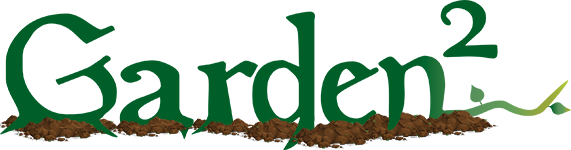

# 

video of the application


## Collaborators
[Josh Flores](), David Garcia, Mark Gardener, Brandon Knight

## Description
An app to help you plan your square foot garden

Through the Garden 2 app the user can find all information about planting vegetables, herbs, and fruit in their area. To get started enter your zip code to find all plants within your hardiness zone. The app will show the plants and planting information for your area. You can drag and drop your plant choices into the square garden to map out your future garden.


## Technologies
This project used [USDA Plant Hardiness Zones API](https://rapidapi.com/aptitudeapps/api/usda-plant-hardiness-zones/) to access hardiness zone based off the users zip code. This app compiled plant data for the user from two databaes, [Companion Plants Database](https://www.kaggle.com/datasets/aramacus/companion-plants) and [Vegetables, Herbs, and Edible Flowers Database](https://data.world/sharon/vegetables-herbs-and-edible-flowers) to include plants name, alternate names, sowing instructions, plant spacing, harvesting instructions, hardiness zone, a plant image, and an external link to further help you in your gardening adventure.  


### USDA Plant Hardiness Zones API
Retrieves the USDA plant hardiness zone and average minimum winter temperature range for the given ZIP code.  
An example of this response:
```
{
  "zone": "6b",
  "min_temp_range": "-5F to 0F"
}
```

---
## Website 
[Deployed on Heroku]()

## Credits
- Thank you to the UTA-Bootcamp team.
- The Coding Collective

## License

[](https://opensource.org/licenses/ISC)
---
