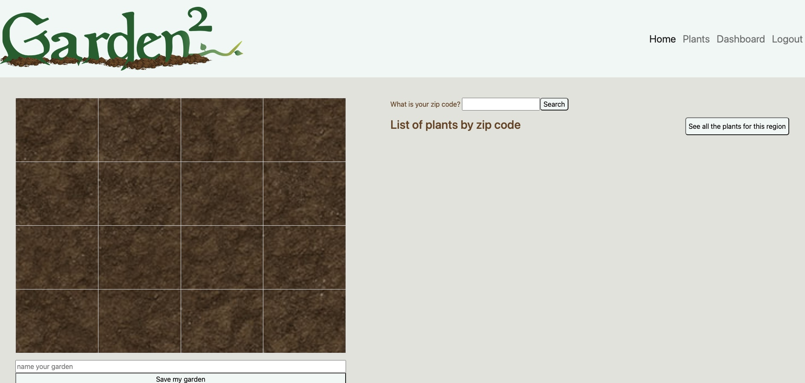

# 


## Collaborators
<a href="https://github.com/MarkGATX/Garden2/graphs/contributors">
  
</a>

Made with [contrib.rocks](https://contrib.rocks).
### Contact US:
[Josh Flores](https://github.com/Spoogh), [David Garcia](https://github.com/parradavid300), [Mark Gardener](https://github.com/MarkGATX), [Brandon Knight](https://github.com/blksmk8483)

## Description
An app to help you plan your square foot garden.

Through the Garden 2 app the user can find all information about planting vegetables, herbs, and fruit in their area. To get started enter your zip code to find all plants within your hardiness zone. The app will then show the plants and planting information for your area. You can drag and drop your plant choices into the square garden map to plan your future garden.

## User Directions

Enter your zipcode.

Recieve a list of plants based on your hardiness zone.

Drag and drop your plant choices.

Click see more to see plant and planting instructions.


## Technologies
This project used [USDA Plant Hardiness Zones API](https://rapidapi.com/aptitudeapps/api/usda-plant-hardiness-zones/) to access hardiness zone based off the users zip code. This app compiled plant data for the user from two databaes, [Companion Plants Database](https://www.kaggle.com/datasets/aramacus/companion-plants) and [Vegetables, Herbs, and Edible Flowers Database](https://data.world/sharon/vegetables-herbs-and-edible-flowers) to include plants name, alternate names, sowing instructions, plant spacing, harvesting instructions, hardiness zone, a plant image, and an external link to further help you in your gardening adventure.  


### USDA Plant Hardiness Zones API
Retrieves the USDA plant hardiness zone and average minimum winter temperature range for the given ZIP code.  
An example of this response:
```
{
  "zone": "6b",
  "min_temp_range": "-5F to 0F"
}
```

---
## Website 
[Click here to see our live site.](https://garden2ed.herokuapp.com/)

## Future Developments
- Implement sharing user garden layout with other user’s.
- Save image of your garden layout
- Having multiple favorite plants and garden layouts on user profiles.
- Migrate database to MongoDB


## Credits
- Thank you to the UTA-Bootcamp team.
- The Coding Collective

## License

[](https://opensource.org/licenses/MIT)
---
